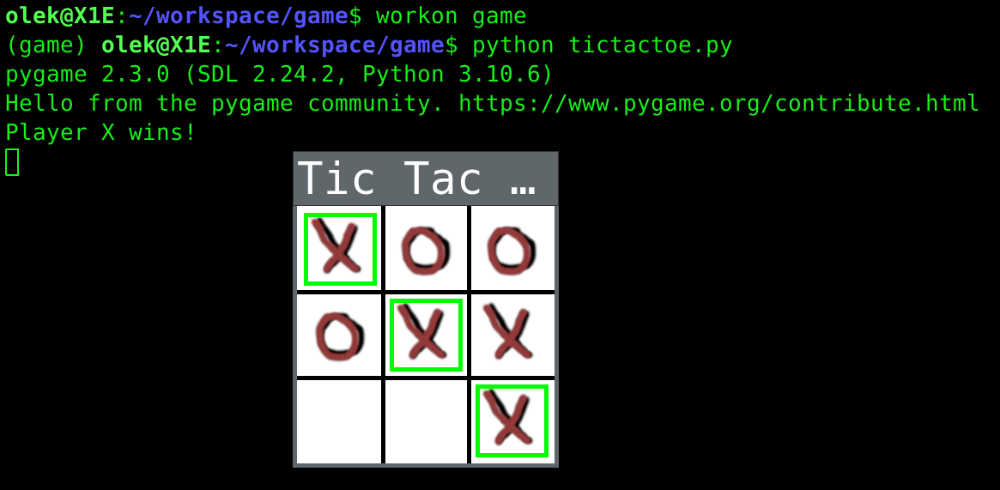

# Крестики нолики
  
```
This repo was created for kids in order to help them in learning python 
and basics of game development
Этот репозиторий сделан для детей, чтобы они учились программировать игры на Python.
```



### План урока для вводного курса по созданию игры "Крестики-нолики" с использованием Pygame
#### 1. Введение в Pygame
   * Объяснить основы Pygame
   * Установка Pygame: pip install pygame
   * Показать простой пример инициализации Pygame и создания окна

#### 2. Настройка окна игры
   * Создать окно игры "Крестики-нолики" с фиксированным размером (300x300 пикселей)
   * Установить название окна "Крестики-нолики"
   * Представить функцию pygame.display.set_mode()

#### 3. Рисование сетки
   * Представить функцию pygame.draw.line()
   * Объяснить, как нарисовать сетку "Крестики-нолики" с помощью вертикальных и горизонтальных линий

#### 4. Обработка ввода мыши
   * Объяснить основы обработки событий в Pygame
   * Представить событие pygame.MOUSEBUTTONUP
   * Показать, как получить позицию мыши с помощью pygame.mouse.get_pos()
   * Рассчитать строку и столбец нажатой ячейки

#### 5. Обновление игрового поля
   * Представить игровое поле в виде списка списков 3x3
   * Обновить нажатую ячейку текущим символом игрока ('X' или 'O')

#### 6. Проверка на победителя
   * Реализовать функцию check_winner()
   * Объяснить, как проверить победителя (ряды, столбцы, диагонали)

#### 7. Рисование иконок X и O
   * Загрузить и масштабировать изображения значков с помощью pygame.image.load() и pygame.transform.scale()
   * Представить функцию screen.blit()
   * Показать, как рисовать иконки X и O на игровом поле

#### 8. Выделение выигрышных ячеек
   * Изменить функцию check_winner(), чтобы она возвращала выигрышные ячейки
   * Реализовать функцию highlight_cells()
   * Объяснить, как рисовать прямоугольники с помощью pygame.draw.rect() для выделения выигрышных ячеек

#### 9. Основной игровой цикл
   * Обсудить структуру основного игрового цикла
   * Объяснить процесс обработки событий, обновления доски и отображения экрана

#### 10. Заключение
   * Повтор


### Введение
Для того чтобы понимать и писать такой код на языке Python, ученик должен быть знаком с основными конструкциями и понятиями языка, такими как:
1. Основы Python: переменные, типы данных (строки, числа, логические значения), операторы, ввод и вывод данных.
2. Управляющие конструкции: условные операторы (if, elif, else) и циклы (for, while).
3. Функции: определение функций, передача аргументов, возвращение значений.
4. Списки: создание списков, индексация, срезы, методы работы со списками (.append(), .remove(), и т.д.)
5. Вложенные списки: использование двумерных списков для представления игрового поля.
6. Модули и пакеты: импортирование модулей (import) и использование функций и классов из сторонних библиотек, таких как Pygame.
7. Обработка событий: работа с событиями ввода, такими как нажатия клавиш и клики мыши.
8. ООП (объектно-ориентированное программирование): классы, объекты, методы и атрибуты. В данном случае не обязательно для понимания кода, но полезно знать, так как Pygame активно использует ООП.
9. Работа с графическими интерфейсами: создание и настройка окон, отрисовка графических примитивов и изображений с использованием библиотеки Pygame.
Овладев этими понятиями и конструкциями, ученик сможет понимать и писать код для разработки простой игры "Крестики-нолики" на языке Python с использованием библиотеки Pygame.


Полная реализация:

Подготовка среды выполнения:
1. Установка `virtualenv` и `virtualenvwrapper`:
```
sudo apt-get update
sudo apt-get install python3-pip
sudo pip3 install virtualenv virtualenvwrapper
```

2. Настройка `virtualenvwrapper`:
```
echo "export WORKON_HOME=$HOME/.virtualenvs" >> ~/.bashrc
echo "export VIRTUALENVWRAPPER_PYTHON=/usr/bin/python3" >> ~/.bashrc
echo "source /usr/local/bin/virtualenvwrapper.sh" >> ~/.bashrc
source ~/.bashrc
```

3. Создание виртуальной среды для проекта:
```
mkvirtualenv tictactoe
```

4. Активация виртуальной среды:
```
workon tictactoe
```

5. Установка зависимостей в виртуальной среде:
```
pip install pygame
```

6. Создайте файл игры, например `tictactoe.py`, и скопируйте в него код игры.

7. Загрузите или создайте иконки X и O (например, `x_icon.png` и `o_icon.png`) и сохраните их в той же директории, что и файл `tictactoe.py`.

8. Запуск игры:
```
python tictactoe.py
```

Полный код реализации [тут](https://github.com/korobool/tic-tac-toe-lesson/blob/main/tictactoe.py)


## А теперь, подробнее:

### 1. Введение в Pygame
Pygame - это популярная библиотека для разработки видеоигр на языке Python. Pygame предоставляет набор инструментов и функций, которые позволяют легко создавать игры и мультимедийные приложения. В этом разделе мы познакомимся с основами работы с Pygame и научимся создавать простое окно.
* Объяснить основы Pygame
Pygame использует модульный подход, поэтому вы можете импортировать только те модули, которые вам нужны. Чтобы начать работу с Pygame, вам сначала нужно установить библиотеку. Если у вас еще не установлен Pygame, вы можете установить его с помощью следующей команды:
* Установка Pygame: pip install pygame
Теперь, когда Pygame установлен, давайте создадим простое окно. Вам нужно импортировать библиотеку Pygame и инициализировать ее перед использованием. Это делается с помощью функции pygame.init().
* Показать простой пример инициализации Pygame и создания окна
Сниппет кода для создания простого окна с использованием Pygame:


```python
import pygame
# Инициализация Pygame
pygame.init()


# Задаем размеры окна
screen_width = 300
screen_height = 300


# Создание окна
screen = pygame.display.set_mode((screen_width, screen_height))
pygame.display.set_caption("Простое окно")


# Основной цикл
running = True
while running:
    for event in pygame.event.get():
        if event.type == pygame.QUIT:
            running = False


    # Обновление экрана
    pygame.display.flip()


# Завершение работы с Pygame
pygame.quit()
```	

### 2. Настройка окна игры
Теперь, когда мы знакомы с основами работы с Pygame, давайте создадим окно для игры "Крестики-нолики". В этом разделе мы настроим окно игры, зададим его размер и установим подходящий заголовок.
* Создать окно игры "Крестики-нолики" с фиксированным размером (300x300 пикселей)
Для создания окна игры нам нужно определить его размеры. Мы будем использовать размер 300x300 пикселей, что достаточно для размещения сетки 3x3 и отображения иконок крестиков и ноликов.
* Установить название окна "Крестики-нолики"
Чтобы установить заголовок окна, мы воспользуемся функцией pygame.display.set_caption(). В качестве аргумента передадим строку с названием игры.
* Представить функцию pygame.display.set_mode()
Функция pygame.display.set_mode() используется для создания окна с указанными размерами. Она принимает кортеж с шириной и высотой окна в пикселях.
Сниппет кода для настройки окна игры "Крестики-нолики":


```python
import pygame
# Инициализация Pygame
pygame.init()


# Задаем размеры окна
screen_width = 300
screen_height = 300


# Создание окна игры
screen = pygame.display.set_mode((screen_width, screen_height))
pygame.display.set_caption("Крестики-нолики")


# Основной цикл игры
running = True
while running:
    for event in pygame.event.get():
        if event.type == pygame.QUIT:
            running = False


    # Обновление экрана
    pygame.display.flip()


# Завершение работы с Pygame
pygame.quit()
```	


В результате выполнения этого кода мы получим окно размером 300x300 пикселей с заголовком "Крестики-нолики". Окно будет отображаться до тех пор, пока пользователь не закроет его. В следующем разделе мы добавим сетку для игры "Крестики-нолики".


### 3. Рисование сетки
Теперь, когда у нас есть окно игры, давайте добавим сетку для игры "Крестики-нолики". Мы нарисуем сетку 3x3, используя вертикальные и горизонтальные линии, и разделим окно на 9 равных ячеек.
* Представить функцию pygame.draw.line()
Для рисования линий в Pygame используется функция pygame.draw.line(). Она принимает следующие аргументы: экран (surface), цвет линии, начальную и конечную точки линии, и толщину линии. Цвет задается в формате RGB.
* Объяснить, как нарисовать сетку "Крестики-нолики" с помощью вертикальных и горизонтальных линий
Чтобы нарисовать сетку, нам нужно нарисовать две горизонтальные линии и две вертикальные линии. Мы определим функцию draw_grid(), которая будет отвечать за рисование сетки на экране.
Сниппет кода для рисования сетки "Крестики-нолики":


```python
import pygame


def draw_grid(screen, width, height):
    grid_color = (255, 255, 255)  # Белый цвет
    grid_thickness = 2  # Толщина линии


    # Рисование вертикальных линий
    for x in range(1, 3):
        pygame.draw.line(screen, grid_color, (x * width // 3, 0), (x * width // 3, height), grid_thickness)


    # Рисование горизонтальных линий
    for y in range(1, 3):
        pygame.draw.line(screen, grid_color, (0, y * height // 3), (width, y * height // 3), grid_thickness)


# Инициализация Pygame
pygame.init()


# Задаем размеры окна
screen_width = 300
screen_height = 300


# Создание окна игры
screen = pygame.display.set_mode((screen_width, screen_height))
pygame.display.set_caption("Крестики-нолики")


# Основной цикл игры
running = True
while running:
    for event in pygame.event.get():
        if event.type == pygame.QUIT:
            running = False


    # Рисование сетки
    draw_grid(screen, screen_width, screen_height)


    # Обновление экрана
    pygame.display.flip()


# Завершение работы с Pygame
pygame.quit()
```


Этот код добавляет сетку на игровое поле, разделяя его на 9 равных ячеек. Сетка будет отображаться на экране до тех пор, пока пользователь не закроет окно. В следующем разделе мы обработаем ввод пользователя с помощью мыши.


### 4. Обработка ввода мыши
Теперь, когда у нас есть сетка для игры "Крестики-нолики", давайте добавим обработку ввода пользователя с помощью мыши. Мы хотим отслеживать клики левой кнопкой мыши и определять, в какой ячейке сетки произошел клик.
* Представить события pygame.MOUSEBUTTONDOWN и pygame.MOUSEBUTTONUP
Pygame предоставляет события для отслеживания нажатия и отпускания кнопок мыши. В данном случае нам нужно обработать событие pygame.MOUSEBUTTONDOWN, которое возникает при нажатии кнопки мыши.
* Объяснить, как определить ячейку сетки, в которой произошел клик
Чтобы определить ячейку сетки, в которой произошел клик, мы можем использовать координаты курсора мыши и делить их на размер ячейки. Это позволит нам получить индексы строки и столбца ячейки.
Сниппет кода для обработки ввода мыши и определения ячейки сетки:


```python
import pygame


def get_grid_cell(screen_width, screen_height, mouse_x, mouse_y):
    cell_width = screen_width // 3
    cell_height = screen_height // 3


    row = mouse_y // cell_height
    col = mouse_x // cell_width


    return row, col

# Инициализация Pygame
pygame.init()

# Задаем размеры окна
screen_width = 300
screen_height = 300

# Создание окна игры
screen = pygame.display.set_mode((screen_width, screen_height))
pygame.display.set_caption("Крестики-нолики")


# Основной цикл игры
running = True
while running:
    for event in pygame.event.get():
        if event.type == pygame.QUIT:
            running = False
        elif event.type == pygame.MOUSEBUTTONDOWN:
            # Левая кнопка мыши нажата
            if event.button == 1:
                mouse_x, mouse_y = event.pos
                row, col = get_grid_cell(screen_width, screen_height, mouse_x, mouse_y)
                print(f"Клик в ячейке ({row}, {col})")


    # Рисование сетки
    draw_grid(screen, screen_width, screen_height)


    # Обновление экрана
    pygame.display.flip()

# Завершение работы с Pygame

pygame.quit()
```	


Этот код обрабатывает ввод пользователя с помощью мыши и выводит координаты ячейки сетки, в которой произошел клик. В следующем разделе мы добавим функциональность для отображения крестиков и ноликов в выбранных ячейках.


### 5. Обновление игрового поля
Теперь, когда мы можем определить ячейку сетки, в которой произошел клик, давайте добавим функциональность для отображения крестиков и ноликов в выбранных ячейках. Для этого нам понадобится хранить состояние игрового поля и обновлять его при каждом ходе.
* Создать двумерный массив для хранения состояния игрового поля
Мы будем использовать двумерный массив размером 3x3 для хранения состояния игрового поля. Значения в массиве будут соответствовать крестикам, ноликам и пустым ячейкам.
* Отобразить крестик или нолик в выбранной ячейке
Чтобы отобразить крестик или нолик в выбранной ячейке, нам нужно загрузить соответствующие изображения и отрисовать их на экране с использованием функции screen.blit().
* Обновлять состояние игрового поля при каждом ходе
При каждом ходе мы будем обновлять состояние игрового поля, заменяя значение в выбранной ячейке на текущий символ (крестик или нолик).
Сниппет кода для обновления игрового поля:


```python
import pygame


# Загрузка изображений крестика и нолика
X_img = pygame.image.load("X.png")
O_img = pygame.image.load("O.png")


# Инициализация игрового поля
game_board = [[None for _ in range(3)] for _ in range(3)]


# Функция для отрисовки символов на игровом поле
def draw_board(screen, board, screen_width, screen_height):
    for row in range(3):
        for col in range(3):
            x = col * screen_width // 3
            y = row * screen_height // 3
            if board[row][col] == "X":
                screen.blit(X_img, (x, y))
            elif board[row][col] == "O":
                screen.blit(O_img, (x, y))


# Определение текущего игрока
current_player = "X"


# Основной цикл игры
running = True
while running:
    for event in pygame.event.get():
        if event.type == pygame.QUIT:
            running = False
        elif event.type == pygame.MOUSEBUTTONDOWN:
            # Левая кнопка мыши нажата
            if event.button == 1:
                mouse_x, mouse_y = event.pos
                row, col = get_grid_cell(screen_width, screen_height, mouse_x, mouse_y)
                if game_board[row][col] is None:
                    game_board[row][col] = current_player
                    current_player = "O" if current_player == "X" else "X"


    # Рисование сетки и символов на игровом поле
    draw_grid(screen, screen_width, screen_height)
    draw_board(screen, game_board, screen_width, screen_height)

# Обновление Экрана
pygame.display.flip()
```

Этот код добавляет функциональность для отображения крестиков и ноликов на игровом поле. Теперь при каждом клике мыши в ячейке сетки будет отображаться соответствующий символ, и текущий игрок будет меняться после каждого хода.


В следующем разделе мы добавим определение победителя и завершение игры, когда один из игроков выиграет или когда закончатся доступные ходы.


### 6. Проверка на победителя
Теперь, когда у нас есть функциональность для отображения крестиков и ноликов на игровом поле, давайте добавим определение победителя. В "Крестики-нолики" победитель определяется, если один из игроков смог заполнить одну из горизонтальных, вертикальных или диагональных линий.
* Создать функцию для проверки победителя
Мы создадим функцию check_winner(), которая примет текущее состояние игрового поля и вернет символ победителя (если он есть) и координаты выигрышной комбинации.
Сниппет кода для проверки победителя:


```python
def check_winner(board):
    for row in range(3):
        if board[row][0] == board[row][1] == board[row][2] and board[row][0] is not None:
            return board[row][0], [(row, 0), (row, 1), (row, 2)]


    for col in range(3):
        if board[0][col] == board[1][col] == board[2][col] and board[0][col] is not None:
            return board[0][col], [(0, col), (1, col), (2, col)]


    if board[0][0] == board[1][1] == board[2][2] and board[0][0] is not None:
        return board[0][0], [(0, 0), (1, 1), (2, 2)]


    if board[0][2] == board[1][1] == board[2][0] and board[0][2] is not None:
        return board[0][2], [(0, 2), (1, 1), (2, 0)]


    return None, []


# ... (остальной код)


# Основной цикл игры
running = True
while running:
    for event in pygame.event.get():
        if event.type == pygame.QUIT:
            running = False
        elif event.type == pygame.MOUSEBUTTONDOWN:
            # Левая кнопка мыши нажата
            if event.button == 1:
                mouse_x, mouse_y = event.pos
                row, col = get_grid_cell(screen_width, screen_height, mouse_x, mouse_y)
                if game_board[row][col] is None:
                    game_board[row][col] = current_player
                    winner, winning_cells = check_winner(game_board)
                    if winner is not None:
                        print(f"Победитель: {winner}")
                        running = False
                    else:
                        current_player = "O" if current_player == "X" else "X"


    # Рисование сетки и символов на игровом поле
    draw_grid(screen, screen_width, screen_height)
    draw_board(screen, game_board, screen_width, screen_height)


    # Обновление экрана
    pygame.display.flip()
# Завершение работы с Pygame
pygame.quit()
```
	


Теперь при каждом ходе будет проверяться победитель, и если победитель определен, игра завершится


### 7. Рисование иконок X и O
В этом разделе мы обсудим, как загрузить и нарисовать иконки X и O, используя изображения, созданные с помощью GIMP. Для этого мы воспользуемся библиотекой Pygame.
* Создание иконок
Для создания иконок можно использовать графический редактор. В данном случае мы используем GIMP. 
Нам нужно будет загружать файлы с расширением png, размер 80х80
'x_icon.png'
'o_icon.png'
Вот так выглядит наша версия:
  
  
  

* Загрузка и масштабирование иконок X и O
Мы уже загрузили иконки X и O из файлов 'x_icon.png' и 'o_icon.png' и масштабировали их до нужного размера. Теперь мы можем использовать эти иконки для отображения на игровом поле.
Сниппет кода для загрузки и масштабирования иконок:


```python
import pygame


# Load assets
x_icon = pygame.image.load('x_icon.png')
o_icon = pygame.image.load('o_icon.png')


# Scale icons
ICON_SIZE = 80
x_icon = pygame.transform.scale(x_icon, (ICON_SIZE, ICON_SIZE))
o_icon = pygame.transform.scale(o_icon, (ICON_SIZE, ICON_SIZE))
```	

* Отображение иконок X и O на игровом поле
Для отображения иконок X и O на игровом поле мы используем функцию screen.blit(), которая копирует содержимое одного изображения на другое.
Сниппет кода для отрисовки иконок X и O на игровом поле:


```python
# Draw icons
for i in range(3):
    for j in range(3):
        x = j * (SCREEN_WIDTH // 3) + (SCREEN_WIDTH // 6) - (ICON_SIZE // 2)
        y = i * (SCREEN_HEIGHT // 3) + (SCREEN_HEIGHT // 6) - (ICON_SIZE // 2)
        if board[i][j] == 'X':
            screen.blit(x_icon, (x, y))
        elif board[i][j] == 'O':
            screen.blit(o_icon, (x, y))
	
```


Теперь, когда вы запустите игру, на игровом поле будут отображаться ваши иконки крестика и нолика, созданные с помощью GIMP.


### 8. Выделение выигрышных ячеек
В этом разделе мы рассмотрим, как выделить выигрышные ячейки после завершения игры. Для этого мы нарисуем прямоугольник вокруг иконок X или O, когда один из игроков выигрывает.
* Функция для выделения выигрышных ячеек
Создадим функцию highlight_cells(), которая принимает список координат выигрышных ячеек и рисует прямоугольники вокруг соответствующих иконок X или O.
Сниппет кода для функции выделения выигрышных ячеек:

```python
def highlight_cells(cells):
    for i, j in cells:
        x = j * (SCREEN_WIDTH // 3) + (SCREEN_WIDTH // 6) - (ICON_SIZE // 2)
        y = i * (SCREEN_HEIGHT // 3) + (SCREEN_HEIGHT // 6) - (ICON_SIZE // 2)
        pygame.draw.rect(screen, GREEN, (x - HIGHLIGHT_WIDTH // 2, y - HIGHLIGHT_WIDTH // 2, ICON_SIZE + HIGHLIGHT_WIDTH, ICON_SIZE + HIGHLIGHT_WIDTH), HIGHLIGHT_WIDTH)
```	

* Выделение выигрышных ячеек в основном цикле игры
В основном цикле игры, после завершения игры, вызовите функцию highlight_cells() с координатами выигрышных ячеек.
Сниппет кода для выделения выигрышных ячеек в основном цикле игры:

```python
if game_over:
    highlight_cells(winning_cells)
```

Теперь при завершении игры выигрышные ячейки будут выделены зелеными прямоугольниками вокруг иконок X или O.


### 9. Основной игровой цикл
В этом разделе мы рассмотрим основной игровой цикл, который управляет логикой игры и отображением на экране. Основной игровой цикл будет выполняться до тех пор, пока игрок не закроет окно игры. Во время игрового цикла программа будет обрабатывать события, обновлять состояние игры и рисовать элементы на экране.
* Цикл while для основного игрового цикла
Основной игровой цикл выполняется внутри цикла while, который продолжает работать до тех пор, пока переменная running не станет равной False.
Сниппет кода для основного игрового цикла:


```python
running = True
game_over = False
while running:
    # Обработка событий
    for event in pygame.event.get():
        # Выход из игры
        if event.type == pygame.QUIT:
            running = False


    # Очистка экрана
    screen.fill(WHITE)


    # Рисование сетки
    draw_grid()


    # Обработка ввода мыши
    if not game_over:
        # ... (код для обработки ввода мыши)


    # Обновление игрового поля
    # ... (код для обновления игрового поля)


    # Рисование иконок X и O
    # ... (код для рисования иконок X и O)


    # Выделение выигрышных ячеек
    if game_over:
        highlight_cells(winning_cells)


    # Обновление дисплея
    pygame.display.flip()
```	


Теперь у вас есть полноценная игра "Крестики-нолики" с графическим интерфейсом на Python с использованием библиотеки Pygame. Вы можете продолжать улучшать игру, добавляя новые функции, такие как подсчет очков или режим для двух игроков.
